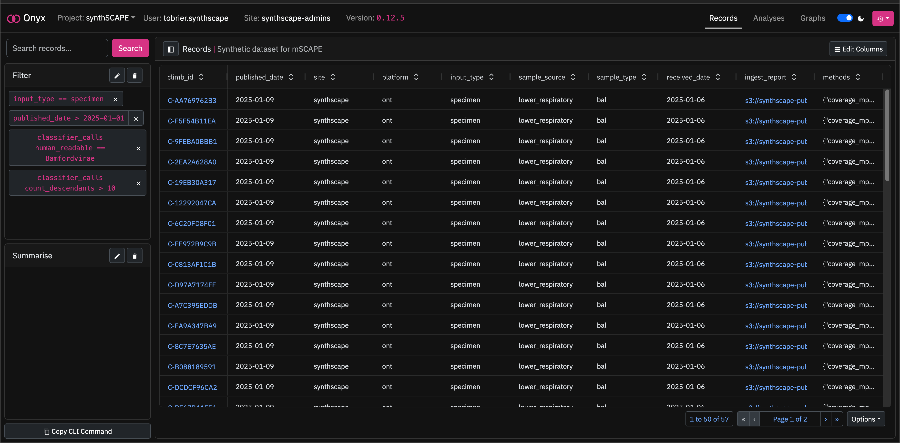
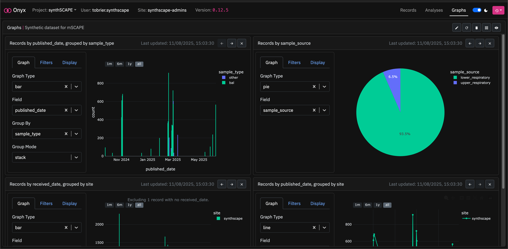
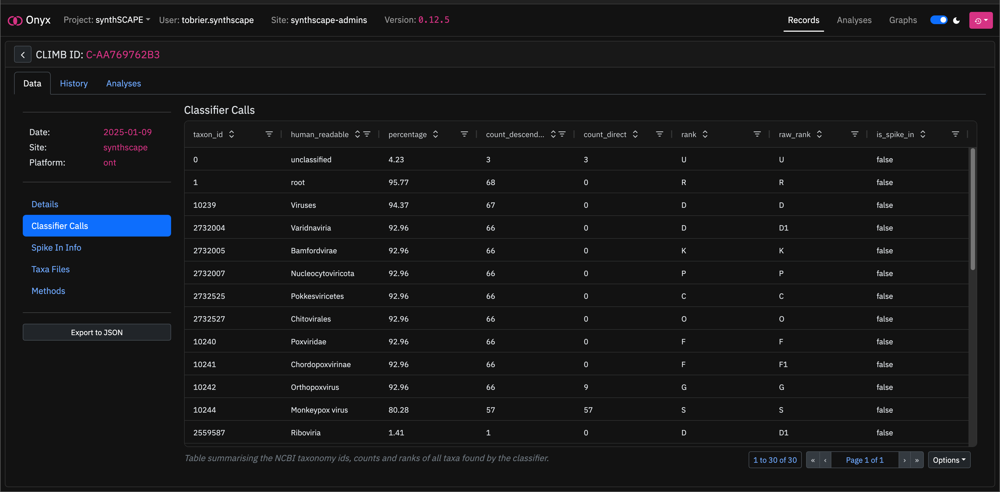

# Onyx Graphical User Interface

## Overview

A Graphical user interface for [Onyx](https://github.com/CLIMB-TRE/onyx), with functionality for browsing and filtering records/analyses, viewing their details and change history, exporting data, and a customisable dashboard for generating graphs of aggregated fields.

The Onyx GUI is currently available as an [npm package](https://www.npmjs.com/package/climb-onyx-gui) under the name `climb-onyx-gui`, and is implemented within the Onyx [JupyterLab extension](https://github.com/CLIMB-TRE/onyx-extension), as part of the [CLIMB-TRE](https://climb-tre.github.io) project.





## Setup

### Install from [npm](https://www.npmjs.com/package/climb-onyx-gui)

```
$ npm install climb-onyx-gui
```

The Onyx GUI can then be imported as a React component:

```typescript
import React from "react";
import ReactDOM from "react-dom";
import Onyx from "climb-onyx-gui";
import "climb-onyx-gui/dist/style.css";

ReactDOM.render(
  <React.StrictMode>
    <Onyx
      httpPathHandler={httpPathHandler}
      s3PathHandler={s3PathHandler}
      fileWriter={fileWriter}
      extVersion={extVersion}
      getItem={getItem}
      setItem={setItem}
      setTitle={setTitle}
    />
  </React.StrictMode>,
  document.getElementById("root")
);
```

See the [JupyterLab extension](https://github.com/CLIMB-TRE/onyx-extension/blob/main/src/onyxWidget.tsx) for an example implementation.

### Local development

Clone the repository:

```
$ git clone https://github.com/CLIMB-TRE/onyx-gui
$ cd onyx-gui/
```

Copy and edit `.env.local` with `VITE_ONYX_DOMAIN` and `VITE_ONYX_TOKEN` for your development instance of Onyx:

```
$ cp .env.local.example .env.local
```

Install dependencies and run the development server:

```
$ npm install
$ npm run dev
```
